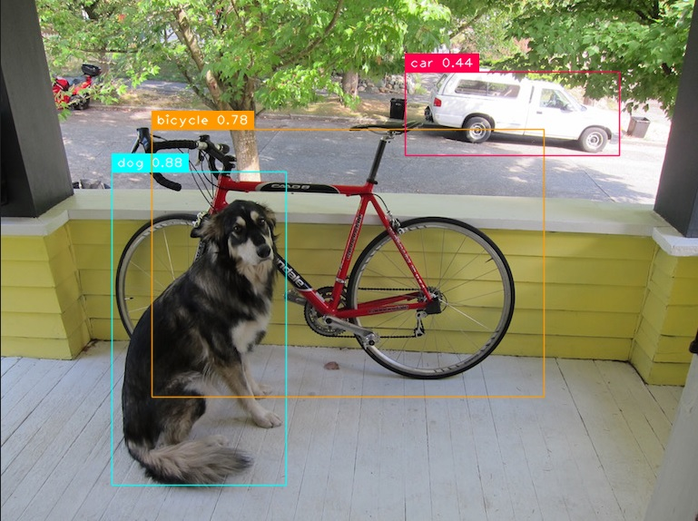
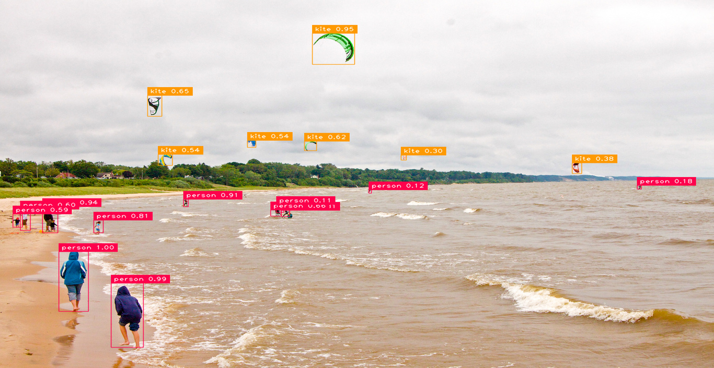
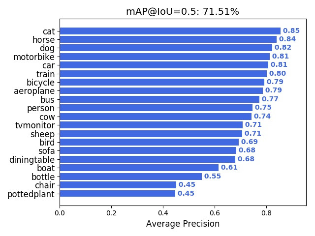
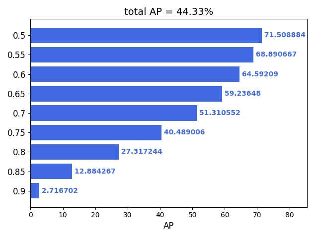

# TF Keras YOLOv4/v3/v2 Modelset

[](LICENSE)

## Introduction

A general YOLOv4/v3/v2 object detection pipeline inherited from [keras-yolo3-Mobilenet](https://github.com/Adamdad/keras-YOLOv3-mobilenet)/[keras-yolo3](https://github.com/qqwweee/keras-yolo3) and [YAD2K](https://github.com/allanzelener/YAD2K). Implement with tf.keras, including data collection/annotation, model training/tuning, model evaluation and on device deployment. Support different architecture and different technologies:

#### Backbone
- [x] CSPDarknet53
- [x] Darknet53/Tiny Darknet
- [x] Darknet19
- [x] MobilenetV1
- [x] MobilenetV2
- [x] MobilenetV3(Large/Small)
- [x] PeleeNet ([paper](https://arxiv.org/abs/1804.06882))
- [x] EfficientNet
- [x] Xception
- [x] VGG16

#### Head
- [x] YOLOv4 (Lite)
- [x] Tiny YOLOv4 (Lite, no-SPP, unofficial)
- [x] YOLOv3 (Lite, SPP)
- [x] YOLOv3 Nano ([paper](https://arxiv.org/abs/1910.01271)) (unofficial)
- [x] Tiny YOLOv3 (Lite)
- [x] YOLOv2 (Lite)
- [x] Tiny YOLOv2 (Lite)

#### Loss
- [x] YOLOv3 loss
- [x] YOLOv2 loss
- [x] Binary focal classification loss
- [x] Softmax focal classification loss
- [x] GIoU localization loss
- [x] DIoU localization loss ([paper](https://arxiv.org/abs/1911.08287))
- [x] Binary focal loss for objectness (experimental)
- [x] Label smoothing for classification loss

#### Postprocess
- [x] Numpy YOLOv3/v2 postprocess implementation
- [x] TFLite/MNN C++ YOLOv3/v2 postprocess implementation
- [x] tf.keras batch-wise YOLOv3/v2 postprocess layer
- [x] DIoU-NMS bounding box postprocess (numpy/C++)
- [x] SoftNMS bounding box postprocess (numpy)
- [x] Eliminate grid sensitivity (numpy/C++, from [YOLOv4](https://arxiv.org/abs/2004.10934))
- [x] WBF(Weighted-Boxes-Fusion) bounding box postprocess (numpy) ([paper](https://arxiv.org/abs/1910.13302))
- [x] Cluster NMS family (Fast/Matrix/SPM/Weighted) bounding box postprocess (numpy) ([paper](https://arxiv.org/abs/2005.03572))

#### Train tech
- [x] Transfer training from imagenet
- [x] Singlescale image input training
- [x] Multiscale image input training
- [x] Dynamic learning rate decay (Cosine/Exponential/Polynomial/PiecewiseConstant)
- [x] Weights Average policy for optimizer (EMA/SWA/Lookahead, valid for TF-2.x with tfa)
- [x] Mosaic data augmentation (from [YOLOv4](https://arxiv.org/abs/2004.10934))
- [x] GridMask data augmentation ([paper](https://arxiv.org/abs/2001.04086))
- [x] Multi anchors for single GT (from [YOLOv4](https://arxiv.org/abs/2004.10934))
- [x] Pruned model training (only valid for TF 1.x)
- [x] Multi-GPU training with SyncBatchNorm support (valid for TF-2.2 and later)

#### On-device deployment
- [x] Tensorflow-Lite Float32/UInt8 model inference
- [x] MNN Float32/UInt8 model inference


## Quick Start

1. Install requirements on Ubuntu 16.04/18.04:

```
# apt install python3-opencv
# pip install Cython
# pip install -r requirements.txt
```

2. Download Related Darknet/YOLOv2/v3/v4 weights from [YOLO website](http://pjreddie.com/darknet/yolo/) and [AlexeyAB/darknet](https://github.com/AlexeyAB/darknet).
3. Convert the Darknet YOLO model to a Keras model.
4. Run YOLO detection on your image or video, default using Tiny YOLOv3 model.

```
# wget -O weights/darknet53.conv.74.weights https://pjreddie.com/media/files/darknet53.conv.74
# wget -O weights/darknet19_448.conv.23.weights https://pjreddie.com/media/files/darknet19_448.conv.23
# wget -O weights/yolov3.weights https://pjreddie.com/media/files/yolov3.weights
# wget -O weights/yolov3-tiny.weights https://pjreddie.com/media/files/yolov3-tiny.weights
# wget -O weights/yolov3-spp.weights https://pjreddie.com/media/files/yolov3-spp.weights
# wget -O weights/yolov2.weights http://pjreddie.com/media/files/yolo.weights
# wget -O weights/yolov2-voc.weights http://pjreddie.com/media/files/yolo-voc.weights
# wget -O weights/yolov2-tiny.weights https://pjreddie.com/media/files/yolov2-tiny.weights
# wget -O weights/yolov2-tiny-voc.weights https://pjreddie.com/media/files/yolov2-tiny-voc.weights

### manually download csdarknet53-omega_final.weights from https://drive.google.com/open?id=18jCwaL4SJ-jOvXrZNGHJ5yz44g9zi8Hm
# wget -O weights/yolov4.weights https://github.com/AlexeyAB/darknet/releases/download/darknet_yolo_v3_optimal/yolov4.weights

# python tools/model_converter/convert.py cfg/yolov3.cfg weights/yolov3.weights weights/yolov3.h5
# python tools/model_converter/convert.py cfg/yolov3-tiny.cfg weights/yolov3-tiny.weights weights/yolov3-tiny.h5
# python tools/model_converter/convert.py cfg/yolov3-spp.cfg weights/yolov3-spp.weights weights/yolov3-spp.h5
# python tools/model_converter/convert.py cfg/yolov2.cfg weights/yolov2.weights weights/yolov2.h5
# python tools/model_converter/convert.py cfg/yolov2-voc.cfg weights/yolov2-voc.weights weights/yolov2-voc.h5
# python tools/model_converter/convert.py cfg/yolov2-tiny.cfg weights/yolov2-tiny.weights weights/yolov2-tiny.h5
# python tools/model_converter/convert.py cfg/yolov2-tiny-voc.cfg weights/yolov2-tiny-voc.weights weights/yolov2-tiny-voc.h5
# python tools/model_converter/convert.py cfg/darknet53.cfg weights/darknet53.conv.74.weights weights/darknet53.h5
# python tools/model_converter/convert.py cfg/darknet19_448_body.cfg weights/darknet19_448.conv.23.weights weights/darknet19.h5

# python tools/model_converter/convert.py cfg/csdarknet53-omega.cfg weights/csdarknet53-omega_final.weights weights/cspdarknet53.h5

### make sure to reorder output tensors for YOLOv4 cfg and weights file
# python tools/model_converter/convert.py --yolo4_reorder cfg/yolov4.cfg weights/yolov4.weights weights/yolov4.h5

### Scaled YOLOv4
### manually download yolov4-csp.weights from https://drive.google.com/file/d/1NQwz47cW0NUgy7L3_xOKaNEfLoQuq3EL/view?usp=sharing
# python tools/model_converter/convert.py --yolo4_reorder cfg/yolov4-csp_fixed.cfg weights/yolov4-csp.weights weights/scaled-yolov4-csp.h5

### Yolo-Fastest
# wget -O weights/yolo-fastest.weights https://github.com/dog-qiuqiu/Yolo-Fastest/raw/master/ModelZoo/yolo-fastest-1.0_coco/yolo-fastest.weights
# wget -O weights/yolo-fastest-xl.weights https://github.com/dog-qiuqiu/Yolo-Fastest/raw/master/ModelZoo/yolo-fastest-1.0_coco/yolo-fastest-xl.weights

# python tools/model_converter/convert.py cfg/yolo-fastest.cfg weights/yolo-fastest.weights weights/yolo-fastest.h5
# python tools/model_converter/convert.py cfg/yolo-fastest-xl.cfg weights/yolo-fastest-xl.weights weights/yolo-fastest-xl.h5


# python yolo.py --image
# python yolo.py --input=<your video file>
```
For other model, just do in a similar way, but specify different model type, weights path and anchor path with `--model_type`, `--weights_path` and `--anchors_path`.

Image detection sample:

<p align="center">
  
  
</p>

## Guide of train/evaluate/demo

### Train
1. Generate train/val/test annotation file and class names file.

    Data annotation file format:
    * One row for one image in annotation file;
    * Row format: `image_file_path box1 box2 ... boxN`;
    * Box format: `x_min,y_min,x_max,y_max,class_id` (no space).
    * Here is an example:
    ```
    path/to/img1.jpg 50,100,150,200,0 30,50,200,120,3
    path/to/img2.jpg 120,300,250,600,2
    ...
    ```
    1. For VOC style dataset, you can use [voc_annotation.py](https://github.com/david8862/keras-YOLOv3-model-set/blob/master/tools/dataset_converter/voc_annotation.py) to convert original dataset to our annotation file:
       ```
       # cd tools/dataset_converter/ && python voc_annotation.py -h
       usage: voc_annotation.py [-h] [--dataset_path DATASET_PATH] [--year YEAR]
                                [--set SET] [--output_path OUTPUT_PATH]
                                [--classes_path CLASSES_PATH] [--include_difficult]
                                [--include_no_obj]

       convert PascalVOC dataset annotation to txt annotation file

       optional arguments:
         -h, --help            show this help message and exit
         --dataset_path DATASET_PATH
                               path to PascalVOC dataset, default is ../../VOCdevkit
         --year YEAR           subset path of year (2007/2012), default will cover
                               both
         --set SET             convert data set, default will cover train, val and
                               test
         --output_path OUTPUT_PATH
                               output path for generated annotation txt files,
                               default is ./
         --classes_path CLASSES_PATH
                               path to class definitions
         --include_difficult   to include difficult object
         --include_no_obj      to include no object image
       ```
       By default, the VOC convert script will try to go through both VOC2007/VOC2012 dataset dir under the dataset_path and generate train/val/test annotation file separately, like:
       ```
       2007_test.txt  2007_train.txt  2007_val.txt  2012_train.txt  2012_val.txt
       ```
       You can merge these train & val annotation file as your need. For example, following cmd will creat 07/12 combined trainval dataset:
       ```
       # cp 2007_train.txt trainval.txt
       # cat 2007_val.txt >> trainval.txt
       # cat 2012_train.txt >> trainval.txt
       # cat 2012_val.txt >> trainval.txt
       ```
       P.S. You can use [LabelImg](https://github.com/tzutalin/labelImg) to annotate your object detection dataset with Pascal VOC XML format

    2. For COCO style dataset, you can use [coco_annotation.py](https://github.com/david8862/keras-YOLOv3-model-set/blob/master/tools/dataset_converter/coco_annotation.py) to convert original dataset to our annotation file:
       ```
       # cd tools/dataset_converter/ && python coco_annotation.py -h
       usage: coco_annotation.py [-h] [--dataset_path DATASET_PATH]
                                 [--output_path OUTPUT_PATH]
                                 [--classes_path CLASSES_PATH] [--include_no_obj]
                                 [--customize_coco]

       convert COCO dataset annotation to txt annotation file

       optional arguments:
         -h, --help            show this help message and exit
         --dataset_path DATASET_PATH
                               path to MSCOCO dataset, default is ../../mscoco2017
         --output_path OUTPUT_PATH
                               output path for generated annotation txt files,
                               default is ./
         --classes_path CLASSES_PATH
                               path to class definitions, default is
                               ../configs/coco_classes.txt
         --include_no_obj      to include no object image
         --customize_coco      It is a user customize coco dataset. Will not follow
                               standard coco class label
       ```
       This script will try to convert COCO instances_train2017 and instances_val2017 under dataset_path. You can change the code for your dataset

   If you want to download PascalVOC or COCO dataset, refer to [Dockerfile](https://github.com/david8862/keras-YOLOv3-model-set/blob/master/Dockerfile) for cmd

   For class names file format, refer to  [coco_classes.txt](https://github.com/david8862/keras-YOLOv3-model-set/blob/master/configs/coco_classes.txt)

2. If you're training YOLOv4/v3/v2 models with Darknet based backbones, make sure you have converted pretrain model weights as in [Quick Start](https://github.com/david8862/keras-YOLOv3-model-set#quick-start) part

3. [train.py](https://github.com/david8862/keras-YOLOv3-model-set/blob/master/train.py)
```
# python train.py -h
usage: train.py [-h] [--model_type MODEL_TYPE] [--anchors_path ANCHORS_PATH]
                [--model_image_size MODEL_IMAGE_SIZE]
                [--weights_path WEIGHTS_PATH]
                [--annotation_file ANNOTATION_FILE]
                [--val_annotation_file VAL_ANNOTATION_FILE]
                [--val_split VAL_SPLIT] [--classes_path CLASSES_PATH]
                [--batch_size BATCH_SIZE] [--optimizer {adam,rmsprop,sgd}]
                [--learning_rate LEARNING_RATE]
                [--average_type {None,ema,swa,lookahead}]
                [--decay_type {None,cosine,exponential,polynomial,piecewise_constant}]
                [--transfer_epoch TRANSFER_EPOCH]
                [--freeze_level {None,0,1,2}] [--init_epoch INIT_EPOCH]
                [--total_epoch TOTAL_EPOCH] [--multiscale]
                [--rescale_interval RESCALE_INTERVAL]
                [--enhance_augment {None,mosaic}]
                [--label_smoothing LABEL_SMOOTHING] [--multi_anchor_assign]
                [--elim_grid_sense] [--data_shuffle] [--gpu_num GPU_NUM]
                [--model_pruning] [--eval_online]
                [--eval_epoch_interval EVAL_EPOCH_INTERVAL]
                [--save_eval_checkpoint]

optional arguments:
  -h, --help            show this help message and exit
  --model_type MODEL_TYPE
                        YOLO model type: yolo3_mobilenet_lite/tiny_yolo3_mobil
                        enet/yolo3_darknet/..., default=yolo3_mobilenet_lite
  --anchors_path ANCHORS_PATH
                        path to anchor definitions,
                        default=configs/yolo3_anchors.txt
  --model_image_size MODEL_IMAGE_SIZE
                        Initial model image input size as <height>x<width>,
                        default=416x416
  --weights_path WEIGHTS_PATH
                        Pretrained model/weights file for fine tune
  --annotation_file ANNOTATION_FILE
                        train annotation txt file, default=trainval.txt
  --val_annotation_file VAL_ANNOTATION_FILE
                        val annotation txt file, default=None
  --val_split VAL_SPLIT
                        validation data persentage in dataset if no val
                        dataset provide, default=0.1
  --classes_path CLASSES_PATH
                        path to class definitions,
                        default=configs/voc_classes.txt
  --batch_size BATCH_SIZE
                        Batch size for train, default=16
  --optimizer {adam,rmsprop,sgd}
                        optimizer for training (adam/rmsprop/sgd),
                        default=adam
  --learning_rate LEARNING_RATE
                        Initial learning rate, default=0.001
  --average_type {None,ema,swa,lookahead}
                        weights average type, default=None
  --decay_type {None,cosine,exponential,polynomial,piecewise_constant}
                        Learning rate decay type, default=None
  --transfer_epoch TRANSFER_EPOCH
                        Transfer training (from Imagenet) stage epochs,
                        default=20
  --freeze_level {None,0,1,2}
                        Freeze level of the model in transfer training stage.
                        0:NA/1:backbone/2:only open prediction layer
  --init_epoch INIT_EPOCH
                        Initial training epochs for fine tune training,
                        default=0
  --total_epoch TOTAL_EPOCH
                        Total training epochs, default=250
  --multiscale          Whether to use multiscale training
  --rescale_interval RESCALE_INTERVAL
                        Number of iteration(batches) interval to rescale input
                        size, default=10
  --enhance_augment {None,mosaic}
                        enhance data augmentation type (None/mosaic),
                        default=None
  --label_smoothing LABEL_SMOOTHING
                        Label smoothing factor (between 0 and 1) for
                        classification loss, default=0
  --multi_anchor_assign
                        Assign multiple anchors to single ground truth
  --elim_grid_sense     Eliminate grid sensitivity
  --data_shuffle        Whether to shuffle train/val data for cross-validation
  --gpu_num GPU_NUM     Number of GPU to use, default=1
  --model_pruning       Use model pruning for optimization, only for TF 1.x
  --eval_online         Whether to do evaluation on validation dataset during
                        training
  --eval_epoch_interval EVAL_EPOCH_INTERVAL
                        Number of iteration(epochs) interval to do evaluation,
                        default=10
  --save_eval_checkpoint
                        Whether to save checkpoint with best evaluation result
```

**NOTE**: if enable "--elim_grid_sense" feature during training, recommended to also use it in following demo/inference step.

Following is a reference training config cmd:
```
# python train.py --model_type=yolo3_mobilenet_lite --anchors_path=configs/yolo3_anchors.txt --annotation_file=trainval.txt --classes_path=configs/voc_classes.txt --eval_online --save_eval_checkpoint
```

Checkpoints during training could be found at `logs/000/`. Choose a best one as result

You can also use Tensorboard to monitor the loss trend during train:
```
# tensorboard --logdir=logs/000
```

MultiGPU usage: use `--gpu_num N` to use N GPUs. It use [tf.distribute.MirroredStrategy](https://www.tensorflow.org/guide/distributed_training#mirroredstrategy) to support MultiGPU environment.

Loss type couldn't be changed from CLI options. You can try them by changing params in [loss.py(v3)](https://github.com/david8862/keras-YOLOv3-model-set/blob/master/yolo3/loss.py) or [loss.py(v2)](https://github.com/david8862/keras-YOLOv3-model-set/blob/master/yolo2/loss.py)

Postprocess type (SoftNMS/DIoU-NMS/Cluster-NMS/WBF) could be configured in [yolo_postprocess_np.py](https://github.com/david8862/keras-YOLOv3-model-set/blob/master/common/yolo_postprocess_np.py)

### Model dump
We need to dump out inference model from training checkpoint for eval or demo. Following script cmd work for that.

```
# python yolo.py --model_type=yolo3_mobilenet_lite --weights_path=logs/000/<checkpoint>.h5 --anchors_path=configs/yolo3_anchors.txt --classes_path=configs/voc_classes.txt --model_image_size=416x416 --dump_model --output_model_file=model.h5
```

Change model_type, anchors file & class file for different training mode. If "--model_pruning" was added in training, you also need to use "--pruning_model" here for dumping out the pruned model.

NOTE: Now you can dump out a non-square input shape (e.g. using `--model_image_size=320x416`) model and do inference as normal, but the input height & weights must be multiples of 32.

### Evaluation
Use [eval.py](https://github.com/david8862/keras-YOLOv3-model-set/blob/master/eval.py) to do evaluation on the inference model with your test data. It support following metrics:

1. Pascal VOC mAP: will generate txt detection result `result/detection_result.txt`, draw rec/pre curve for each class and AP/mAP result chart in "result" dir with default 0.5 IOU or specified IOU, and optionally save all the detection result on evaluation dataset as images

2. MS COCO AP. will generate txt detection result, draw overall AP chart and AP on different scale (small, medium, large) as COCO standard. It can also optionally save all the detection result

```
# python eval.py --model_path=model.h5 --anchors_path=configs/yolo3_anchors.txt --classes_path=configs/voc_classes.txt --model_image_size=416x416 --eval_type=VOC --iou_threshold=0.5 --conf_threshold=0.001 --annotation_file=2007_test.txt --save_result
```

If you're evaluating with MSCOCO dataset, you can further use [pycoco_eval.py](https://github.com/david8862/keras-YOLOv3-model-set/blob/master/tools/evaluation/pycoco_eval.py) with the generated txt detection result and COCO GT annotation to get official COCO AP with [pycocotools](https://github.com/cocodataset/cocoapi/tree/master/PythonAPI/pycocotools):

```
# cd tools/evaluation/ && python pycoco_eval.py -h
usage: pycoco_eval.py [-h] --result_txt RESULT_TXT --coco_annotation_json
                      COCO_ANNOTATION_JSON
                      [--coco_result_json COCO_RESULT_JSON] [--customize_coco]

generate coco result json and evaluate COCO AP with pycocotools

optional arguments:
  -h, --help            show this help message and exit
  --result_txt RESULT_TXT
                        txt detection result file
  --coco_annotation_json COCO_ANNOTATION_JSON
                        coco json annotation file
  --coco_result_json COCO_RESULT_JSON
                        output coco json result file, default is
                        ./coco_result.json
  --customize_coco      It is a user customize coco dataset. Will not follow
                        standard coco class label

# python pycoco_eval.py --result_txt=../../result/detection_result.txt --coco_annotation_json=./instances_val2017.json --coco_result_json=coco_result.json
```

You can use [tide_eval.py](https://github.com/david8862/keras-YOLOv3-model-set/blob/master/tools/evaluation/tide_eval.py) with the output COCO json result and COCO GT annotation for detection errors analysis. It's proposed and supported by [tide](https://github.com/dbolya/tide):

```
# cd tools/evaluation/ && python tide_eval.py -h
usage: tide_eval.py [-h] --coco_annotation_json COCO_ANNOTATION_JSON
                    --coco_result_json COCO_RESULT_JSON

evaluate TIDE dAP with tidecv

optional arguments:
  -h, --help            show this help message and exit
  --coco_annotation_json COCO_ANNOTATION_JSON
                        coco json annotation file
  --coco_result_json COCO_RESULT_JSON
                        coco json result file

# python tide_eval.py --coco_annotation_json=./instances_val2017.json --coco_result_json=coco_result.json
```

P.S. for VOC style dataset, we also provide [pascal_voc_to_coco.py](https://github.com/david8862/keras-YOLOv3-model-set/blob/master/tools/dataset_converter/pascal_voc_to_coco.py) to generate COCO GT annotation.

If you enable "--eval_online" option in train.py, a default Pascal VOC mAP evaluation on validation dataset will be executed during training. But that may cost more time for train process.


Following is a sample result trained on Mobilenet YOLOv3 Lite model with PascalVOC dataset (using a reasonable score threshold=0.1):
<p align="center">
  
  
</p>

Some experiment on MSCOCO dataset and comparison:

| Model name | InputSize | TrainSet | TestSet | COCO AP | Pascal mAP@.5 | FLOPS | Param | Size | Speed | Ps |
| ----- | ------ | ------ | ------ | ----- | ----- | ----- | ----- | ----- | ----- | ----- |
| [YOLOv3 Lite-Mobilenet](https://github.com/david8862/keras-YOLOv3-model-set/releases/download/v1.1.0/yolo3_mobilenet_lite_320_coco.tar.gz) | 320x320 | train2017 | val2017 | 19.40 | 38.58 | 4.76G | 8.09M | 32MB | 14.6ms | Keras on Titan XP |
| [YOLOv3 Lite-Mobilenet](https://github.com/david8862/keras-YOLOv3-model-set/releases/download/v1.1.0/yolo3_mobilenet_lite_416_coco.tar.gz) | 416x416 | train2017 | val2017 | 22.69 | 43.61 | 8.04G | 8.09M | 32MB | 16.9ms | Keras on Titan XP |
| [Tiny YOLOv3 Lite-Mobilenet](https://github.com/david8862/keras-YOLOv3-model-set/releases/download/v1.1.0/tiny_yolo3_mobilenet_lite_320_coco.tar.gz) | 320x320 | train2017 | val2017 | 16.41 | 34.17 | 3.04G | 5.19M | 21MB | 8.7ms | Keras on Titan XP |
| [Tiny YOLOv3 Lite-Mobilenet](https://github.com/david8862/keras-YOLOv3-model-set/releases/download/v1.1.0/tiny_yolo3_mobilenet_lite_416_coco.tar.gz) | 416x416 | train2017 | val2017 | 19.28 | 39.36 | 5.13G | 5.19M | 21MB | 9.3ms | Keras on Titan XP |
| [YOLOv3-Xception](https://github.com/david8862/keras-YOLOv3-model-set/releases/download/v1.1.0/yolo3_xception_608_coco.tar.gz) | 608x608 | train2017 | val2017 | 27.14 | 51.89 | 209.53G | 105.37M | 403MB | 56ms | Keras on Titan XP |
| [ssd_mobilenet_v1_coco](https://github.com/tensorflow/models/blob/master/research/object_detection/g3doc/detection_model_zoo.md) | 600x600 | COCO train | COCO val | 21 |  |  |  | 28MB | 30ms | TF on Titan X |
| [ssdlite_mobilenet_v2_coco](https://github.com/tensorflow/models/blob/master/research/object_detection/g3doc/detection_model_zoo.md) | 600x600 | COCO train | COCO val | 22 |  |  |  | 19MB | 27ms | TF on Titan X |

Some experiment on PascalVOC dataset and comparison:

| Model name | InputSize | TrainSet | TestSet | mAP | FLOPS | Param | Size | Speed | Ps |
| ----- | ------ | ------ | ------ | ----- | ----- | ----- | ----- | ----- | ----- |
| [**YOLOv4 Efficientnet(B1)**](https://github.com/david8862/keras-YOLOv3-model-set/releases/download/v1.2.0/yolo4_efficientnet_512_voc.tar.gz) | 512x512 | VOC07+12 | VOC07 | **82.39%** | 62.02G | 65.32M | 251MB | 44ms | Keras on Titan XP |
| [**Tiny YOLOv3 Lite-MobilenetV3Small**](https://github.com/david8862/keras-YOLOv3-model-set/releases/download/v1.2.0/tiny_yolo3_mobilenetv3small_lite_416_voc.tar.gz) | 416x416 | VOC07+12 | VOC07 | 65.09% | **731.64M** | **1.50M** | **6.5MB** | 110ms | MNN on ARM Cortex-A53 * 4 |
| [YOLOv3 Lite-Mobilenet](https://github.com/david8862/keras-YOLOv3-model-set/releases/download/v1.0.0/yolo3_mobilnet_lite_320_voc.tar.gz) | 320x320 | VOC07+12 | VOC07 | 73.47% | 4.51G | 7.77M | 31.8MB | 17ms | Keras on Titan XP |
| [YOLOv3 Lite-Mobilenet](https://github.com/david8862/keras-YOLOv3-model-set/releases/download/v1.0.0/yolo3_mobilnet_lite_416_voc.tar.gz) | 416x416 | VOC07+12 | VOC07 | 76.55% | 7.60G | 7.77M | 31.8MB | 20ms | Keras on Titan XP |
| [YOLOv3 Lite-SPP-Mobilenet](https://github.com/david8862/keras-YOLOv3-model-set/releases/download/v1.0.0/yolo3_mobilnet_lite_spp_416_voc.tar.gz) | 416x416 | VOC07+12 | VOC07 | 76.32% | 7.98G | 8.81M | 34MB | 22ms | Keras on Titan XP |
| [YOLOv3 Lite-PeleeNet](https://github.com/david8862/keras-YOLOv3-model-set/releases/download/v1.3.0/yolo3_peleenet_lite_416_voc.tar.gz) | 416x416 | VOC07+12 | VOC07 | 78.07% | 6.60G | 4.92M | 21MB | 33ms | Keras on Titan XP |
| [Tiny YOLOv3 Lite-Mobilenet](https://github.com/david8862/keras-YOLOv3-model-set/releases/download/v1.0.0/tiny_yolo3_mobilnet_lite_320_voc.tar.gz) | 320x320 | VOC07+12 | VOC07 | 69.10% | 2.93G | 4.92M | 20.1MB | 9ms | Keras on Titan XP |
| [Tiny YOLOv3 Lite-Mobilenet](https://github.com/david8862/keras-YOLOv3-model-set/releases/download/v1.0.0/tiny_yolo3_mobilnet_lite_416_voc.tar.gz) | 416x416 | VOC07+12 | VOC07 | 72.90% | 4.95G | 4.92M | 20.1MB | 11ms | Keras on Titan XP |
| [Tiny YOLOv3 Lite-Mobilenet with GIoU loss](https://github.com/david8862/keras-YOLOv3-model-set/releases/download/v1.0.0/tiny_yolo3_mobilnet_lite_giou_416_voc.tar.gz) | 416x416 | VOC07+12 | VOC07 | 72.92% | 4.95G | 4.92M | 20.1MB | 11ms | Keras on Titan XP |
| [YOLOv3 Nano](https://github.com/david8862/keras-YOLOv3-model-set/releases/download/v1.0.1/yolo3_nano_weights_416_voc.tar.gz) | 416x416 | VOC07+12 | VOC07 | 69.55% | 6.40G | 4.66M | 19MB | 29ms | Keras on Titan XP |
| [YOLOv3-Xception](https://github.com/david8862/keras-YOLOv3-model-set/releases/download/v1.0.0/yolo3_xception_512_voc.tar.gz) | 512x512 | VOC07+12 | VOC07 | 79.15% | 147.30G | 104.72M | 419.8MB | 48ms | Keras on Titan XP |
| [YOLOv3-Mobilenet](https://github.com/Adamdad/keras-YOLOv3-mobilenet) | 320x320 | VOC07 | VOC07 | 64.22% |  |  |  | 29fps | Keras on 1080Ti |
| [YOLOv3-Mobilenet](https://github.com/Adamdad/keras-YOLOv3-mobilenet) | 320x320 | VOC07+12 | VOC07 | 74.56% |  |  |  | 29fps | Keras on 1080Ti |
| [YOLOv3-Mobilenet](https://github.com/Adamdad/keras-YOLOv3-mobilenet) | 416x416 | VOC07+12 | VOC07 | 76.82% |  |  |  | 25fps | Keras on 1080Ti |
| [MobileNet-SSD](https://github.com/chuanqi305/MobileNet-SSD) | 300x300 | VOC07+12+coco | VOC07 | 72.7% |  |  | 22MB |  |  |
| [MobileNet-SSD](https://github.com/chuanqi305/MobileNet-SSD) | 300x300 | VOC07+12 | VOC07 | 68% |  |  | 22MB |  |  |
| [Faster RCNN, VGG-16](https://github.com/ShaoqingRen/faster_rcnn) | ~1000x600 | VOC07+12 | VOC07 | 73.2% |  |  |  | 151ms | Caffe on Titan X |
| [SSD,VGG-16](https://github.com/pierluigiferrari/ssd_keras) | 300x300 | VOC07+12 | VOC07	| 77.5% |  |  | 201MB | 39fps | Keras on Titan X |


**NOTE**:
1. mAP/AP is evaluated with "Weighted-Distance-Cluster-NMS" post process, which has better performance than Traditional NMS

2. If you meet any model loading problem with these pretrained weights due to h5 format compatibility issue, try to run "Model dump" with it again to regenerate the inference model.


### Demo
1. [yolo.py](https://github.com/david8862/keras-YOLOv3-model-set/blob/master/yolo.py)
> * Demo script for trained model

image detection mode
```
# python yolo.py --model_type=yolo3_mobilenet_lite --weights_path=model.h5 --anchors_path=configs/yolo3_anchors.txt --classes_path=configs/voc_classes.txt --model_image_size=416x416 --image
```
video detection mode
```
# python yolo.py --model_type=yolo3_mobilenet_lite --weights_path=model.h5 --anchors_path=configs/yolo3_anchors.txt --classes_path=configs/voc_classes.txt --model_image_size=416x416 --input=test.mp4
```
For video detection mode, you can use "input=0" to capture live video from web camera and "output=<video name>" to dump out detection result to another video

### Tensorflow model convert
Using [keras_to_tensorflow.py](https://github.com/david8862/keras-YOLOv3-model-set/tree/master/tools/model_converter/keras_to_tensorflow.py) to convert the tf.keras .h5 model to tensorflow frozen pb model:
```
# python keras_to_tensorflow.py
    --input_model="path/to/keras/model.h5"
    --output_model="path/to/save/model.pb"
```

### ONNX model convert
Using [keras_to_onnx.py](https://github.com/david8862/keras-YOLOv3-model-set/tree/master/tools/model_converter/keras_to_onnx.py) to convert the tf.keras .h5 model to ONNX model:
```
### need to set environment TF_KERAS=1 for tf.keras model
# export TF_KERAS=1
# python keras_to_onnx.py
    --keras_model_file="path/to/keras/model.h5"
    --output_file="path/to/save/model.onnx"
    --op_set=11
```

You can also use [eval.py](https://github.com/david8862/keras-YOLOv3-model-set/blob/master/eval.py) to do evaluation on the pb & onnx inference model

### Inference model deployment
See [on-device inference](https://github.com/david8862/keras-YOLOv3-model-set/tree/master/inference) for TFLite & MNN model deployment


### TODO
- [ ] Gaussian YOLOv3 loss
- [ ] support Quantization aware training
- [ ] provide more imagenet pretrained backbone (e.g. shufflenet, shufflenetv2), see [Training backbone](https://github.com/david8862/keras-YOLOv3-model-set/tree/master/common/backbones/imagenet_training)


## Some issues to know

1. The test environment is
    - Ubuntu 16.04/18.04
    - Python 3.6.8
    - tensorflow 2.0.0/tensorflow 1.15.0
    - tf.keras 2.2.4-tf

2. Default YOLOv4/v3/v2 anchors are used. If you want to use your own anchors, probably some changes are needed. [kmeans.py](https://github.com/david8862/keras-YOLOv3-model-set/blob/master/tools/misc/kmeans.py) could be used to do K-Means anchor clustering on your dataset

3. Imagenet pretrained weights for backbone is automatically loaded when training, so recommended to freeze backbone layers for several epochs in transfer traning stage.

4. Training strategy is for reference only. Adjust it according to your dataset and your goal. And add further strategy if needed.


## Contribution guidelines
New features, improvements and any other kind of contributions are warmly welcome via pull request :)


# Citation
Please cite keras-YOLOv3-model-set in your publications if it helps your research:
```
@article{MobileNet-Yolov3,
     Author = {Adam Yang},
     Year = {2018}
}
@article{keras-yolo3,
     Author = {qqwweee},
     Year = {2018}
}
@article{YAD2K,
     title={YAD2K: Yet Another Darknet 2 Keras},
     Author = {allanzelener},
     Year = {2017}
}
@article{yolov4,
     title={YOLOv4: Optimal Speed and Accuracy of Object Detection},
     author={Alexey Bochkovskiy, Chien-Yao Wang, Hong-Yuan Mark Liao},
     journal = {arXiv},
     year={2020}
}
@article{yolov3,
     title={YOLOv3: An Incremental Improvement},
     author={Redmon, Joseph and Farhadi, Ali},
     journal = {arXiv},
     year={2018}
}
@article{redmon2016yolo9000,
  title={YOLO9000: Better, Faster, Stronger},
  author={Redmon, Joseph and Farhadi, Ali},
  journal={arXiv preprint arXiv:1612.08242},
  year={2016}
}
@article{Focal Loss,
     title={Focal Loss for Dense Object Detection},
     author={Tsung-Yi Lin, Priya Goyal, Ross Girshick, Kaiming He, Piotr Dollár},
     journal = {arXiv},
     year={2017}
}
@article{GIoU,
     title={Generalized Intersection over Union: A Metric and A Loss for Bounding Box Regression},
     author={Hamid Rezatofighi, Nathan Tsoi1, JunYoung Gwak1, Amir Sadeghian, Ian Reid, Silvio Savarese},
     journal = {arXiv},
     year={2019}
}
@article{DIoU Loss,
     title={Distance-IoU Loss: Faster and Better Learning for Bounding Box Regression},
     author={Zhaohui Zheng, Ping Wang, Wei Liu, Jinze Li, Rongguang Ye, Dongwei Ren},
     journal = {arXiv},
     year={2020}
}
@inproceedings{tide-eccv2020,
  author    = {Daniel Bolya and Sean Foley and James Hays and Judy Hoffman},
  title     = {TIDE: A General Toolbox for Identifying Object Detection Errors},
  booktitle = {ECCV},
  year      = {2020},
}
```
